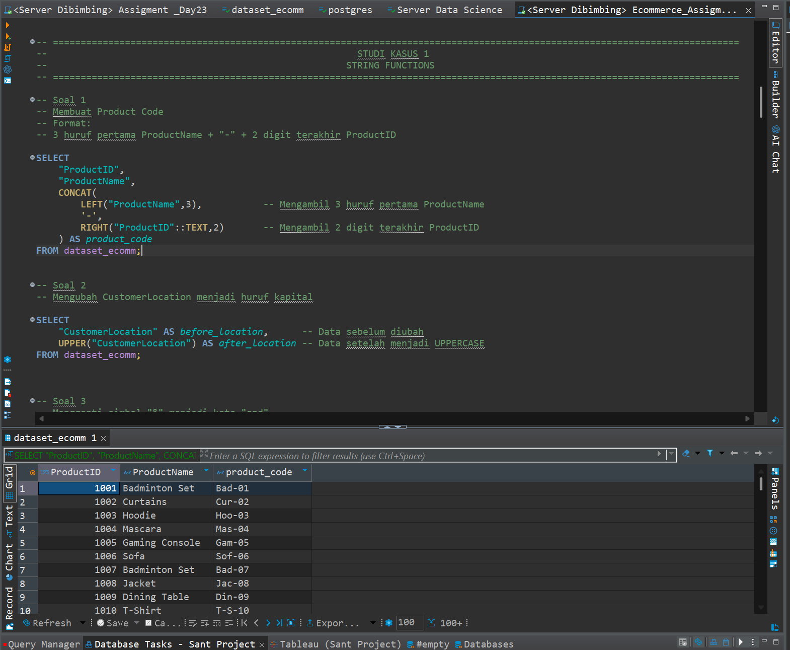
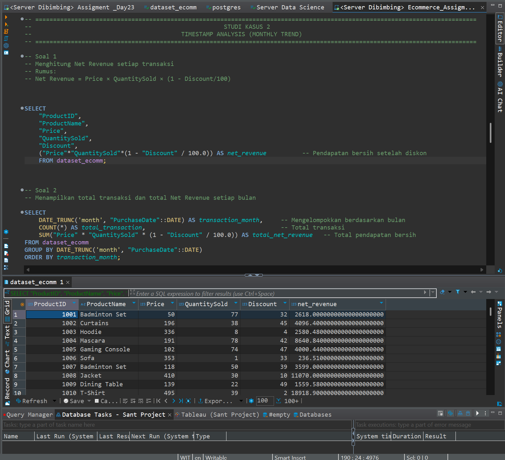
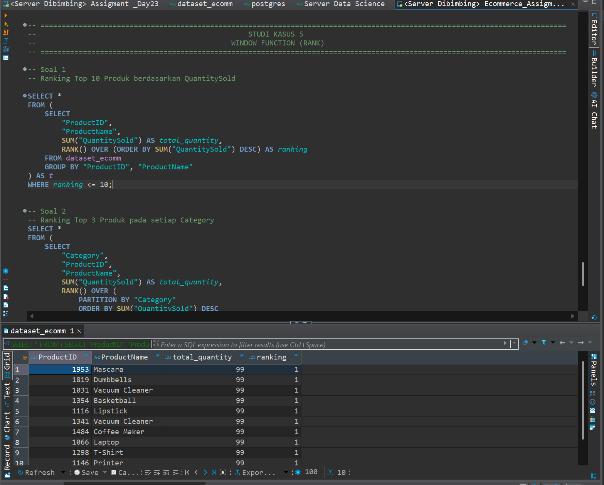
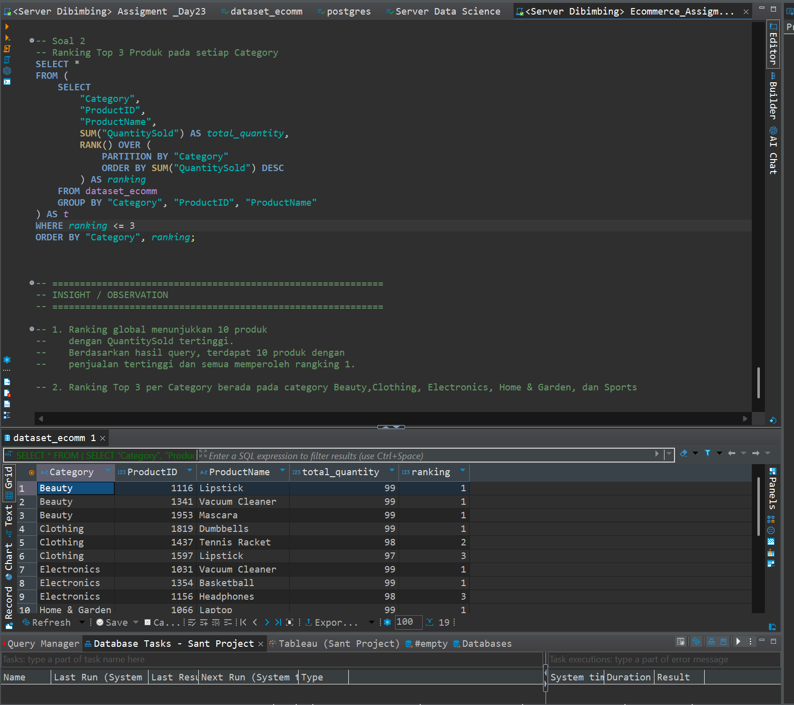

# Advanced SQL E-Commerce Analysis

Advanced SQL project using **PostgreSQL** and **DBeaver** to analyze an e-commerce dataset. This project demonstrates data preparation, data cleaning, time-based analysis, subqueries, Common Table Expressions (CTE), and window functions for business insights.

---

## 📁 Project Structure

```
advanced-sql-ecommerce-analysis/
│
├── Advanced_SQL_Assignment.sql
├── README.md
├── dataset_ecomm.csv
└── screenshots/
    ├── string_functions.png
    ├── monthly_trend.png
    ├── last_7_days.png
    ├── subquery_cte.png
    ├── ranking_global.png
    └── ranking_category.png
```

---

## 🛠️ Tools

- PostgreSQL
- DBeaver

---

## 📚 SQL Concepts

- Data Preparation
- String Functions
  - LEFT()
  - RIGHT()
  - CONCAT()
  - REPLACE()
  - SUBSTRING()
  - UPPER()
  - LOWER()
  - LENGTH()
- Timestamp Functions
  - DATE_TRUNC()
  - EXTRACT()
  - INTERVAL
  - NOW()
  - CURRENT_TIMESTAMP
- Subquery
- Common Table Expression (CTE)
- Window Functions
  - RANK()
  - PARTITION BY

---

## 📈 Case Study 1 — String Functions

Created product codes and cleaned text data using SQL string functions.

### Screenshot



---

## 📅 Case Study 2 — Monthly Revenue Trend

Analyzed monthly transactions and Net Revenue using DATE_TRUNC() and EXTRACT().

### Screenshot



---

## 📆 Case Study 3 — Last 7 Days Transactions

Retrieved transactions from the last seven days based on the latest transaction date.

### Screenshot


---

## 📊 Case Study 4 — Subquery & CTE

Identified transactions above the average Price and Net Revenue using Subquery and Common Table Expression (CTE).

### Screenshot


---

## 🏆 Case Study 5 — Product Ranking

Generated global product rankings and category-based rankings using Window Functions.

### Global Ranking



### Ranking per Category



---

## 💡 Key Insights

- Product codes were generated using SQL string functions.
- Customer locations and product categories were standardized.
- Monthly Net Revenue trends were successfully analyzed.
- Transactions within the last seven days were identified.
- Products with above-average Price and Net Revenue were detected.
- Window Functions enabled both global and category-based product rankings.

---

## 👨‍💻 Author

**Joko Santoso**

Data Analyst Portfolio Project
